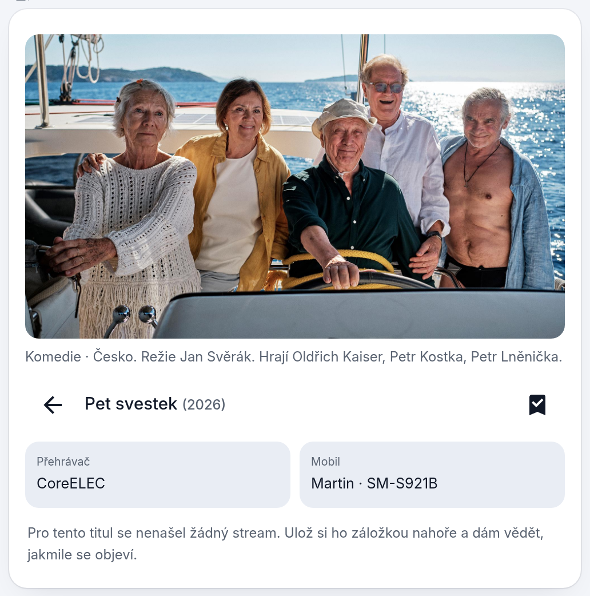

# Nokturno pro Home Assistant

[](https://ko-fi.com/matata86)
[](https://hacs.xyz/)

[](https://my.home-assistant.io/redirect/hacs_repository/?owner=matata86&repository=nokturno-ha&category=integration)
[](https://my.home-assistant.io/redirect/config_flow_start/?domain=nokturno)

První tlačítko otevře repozitář rovnou v HACS tvojí instance, druhé spustí průvodce nastavením integrace.

Hledání filmů a seriálů ve **WebShare**, **Sosáči** a **Luně** přímo z Home Assistantu — s přehráním v Kodi, stažením do HA nebo odesláním odkazu do mobilu.

> **Patří k sobě:** [**plugin.video.nokturno**](https://github.com/matata86/plugin.video.nokturno) je klient pro Kodi, tahle integrace jeho protějšek v Home Assistantu. Sdílejí knihovny zdrojů i účty a přehrávání na TV vede přes doplněk, takže si Kodi drží „Pokračovat ve sledování". Streamovací server Luna jde provozovat jako [addon HA](https://github.com/matata86/ha-addons).

 

## Obsah

- [Co to umí](#co-to-umí)
- [Instalace](#instalace)
- [Nastavení integrace](#nastavení-integrace)
- [Karta na dashboard](#karta-na-dashboard)
- [Ovládací prvky karty](#ovládací-prvky-karty)
- [Entity](#entity)
- [Služby](#služby)
- [Události](#události)
- [Příklady automatizací](#příklady-automatizací)
- [Jak to funguje uvnitř](#jak-to-funguje-uvnitř)
- [Řešení potíží](#řešení-potíží)

## Co to umí

- **Jedno hledání ve všech zdrojích** — stejný titul z Luny i Sosáče se sloučí do jedné položky, streamy se pak nabídnou ze všech zdrojů naráz. U každého streamu je zdroj, kvalita, název souboru, jazyky zvuku i titulků a velikost.
- **Přehrání v Kodi přes doplněk Nokturno**, takže si Kodi vede „Pokračovat ve sledování" a pamatuje si pozici. Ostatní přehrávače (TV, Cast) dostanou přímé URL.
- **Odeslání do mobilu** — notifikace s odkazem, klepnutím se spustí ve VLC (posílá se jako Android intent s typem videa, jinak by telefon soubor jen stáhl).
- **Stahování do `/media/nokturno`** s frontou, průběhem, rychlostí a odhadem času; přerušené stahování (restart HA, výpadek) se po startu samo dokončí od místa, kde skončilo; hotové soubory jsou vidět v kartě **na úvodní obrazovce**, dají se přehrát, smazat nebo poslat do mobilu odkazem přes Nabu Casa. Titulky se stáhnou vedle videa a mažou se spolu s ním.
- **Odkazy použitelné mimo domácí síť** (ikona 🌐) — přímo z CDN WebShare nebo ze Sosáče; ostatní se přepíšou na adresu z Tailscale/VPN, když ji vyplníš a addon Tailscale běží.
- **Pokračovat ve sledování** ze všech Kodi v domácnosti; klepnutí otevře streamy titulu, takže si vybereš, kde a jak pokračovat.
- **Sledované seriály** — nový díl se hlásí, až když se dá pustit, ne když ho jen eviduje TMDB. Když stream není a máš nastavený Prowlarr, kontrola sáhne i na trackery.
- **Seznam „k zhlédnutí"** — u titulu klepneš na záložku a integrace jednou denně kontroluje, jestli už má stream; jakmile se objeví, přijde oznámení. Přidat jde i titul, který **zatím žádný zdroj nemá** (chystaný film) — hledá se v databázi filmů (IMDb/TMDB přes Cinemetu). Funguje samostatně, **Trakt k tomu není potřeba**.
- **Trakt.tv** (volitelně) — propojení účtu, hlášení přehrávání, zápis do historie a načtení seznamu k zhlédnutí z Traktu. Pozor: Trakt od července 2026 vydává API klíče jen pro VIP účty, takže bez VIP tuhle část nezapneš — vlastní seznam funguje i tak.
- **Rok v dotazu je filtr** — „Pět švestek 2026" najde jen film z roku 2026, ne stejnojmenný o čtyřicet let starší. Číslo, které je součástí názvu („2012", „Blade Runner 2049"), se jako rok nebere. Rok se hlídá i u souborů z fulltextu WebShare, takže se k titulu nepřimíchá stejnojmenný film z jiného roku.
- **Jedno hledání pro filmy i seriály** — přepínač *Filmy / Seriály* se objeví, jen když dotaz sedí na obojí; jinak karta rovnou ukáže to, co našla. Stejně to funguje i v doplňku do Kodi.
- **Databáze filmů po ruce vždycky** — tlačítko *Hledat v databázi filmů* je u každých výsledků, ne jen když zdroje nic nenajdou. Klepnutím na titul se otevře jeho detail s plakátem a popisem (u chystaných filmů, které popis nikde nemají, aspoň žánr, režie a obsazení) a záložkou v něm si ho uložíš do seznamu k zhlédnutí. Dokud jsi v databázi, hledá tam i tlačítko *Hledat*.
- **Torrenty jako poslední možnost** — když na titul nikde stream není, tlačítko *Hledat torrenty* pod seznamem prohledá trackery přes [Prowlarr](https://prowlarr.com/) a nalezené torrenty předá qBittorrentu. Hledá se **až na vyžádání**, protože trackery odpovídají v řádu sekund a otevření detailu by to zdržovalo. Vypnuté, dokud Prowlarr nevyplníš.
- **Hlasovka jedním krokem** — službám stačí `query` místo ID.

## Instalace

### HACS (doporučeno)

1. HACS → tři tečky vpravo nahoře → **Vlastní repozitáře** (nebo [](https://my.home-assistant.io/redirect/hacs_repository/?owner=matata86&repository=nokturno-ha&category=integration))
2. URL `https://github.com/matata86/nokturno-ha`, typ **Integrace**
3. Najdi **Nokturno**, nainstaluj a restartuj Home Assistant
4. **Nastavení → Zařízení a služby → Přidat integraci → Nokturno** (nebo [](https://my.home-assistant.io/redirect/config_flow_start/?domain=nokturno))

Kartu integrace naservíruje sama a sama si ji zapíše do zdrojů Lovelace (`/nokturno/nokturno-card.js?v=…`) — nic nepřidávej ručně. Pokud jsi ji tam dřív přidal z `/local/…`, ten záznam odeber.

### Ručně

Zkopíruj složku `custom_components/nokturno` do své konfigurace a restartuj HA.

> **Po aktualizaci** mobilní aplikaci úplně zavři a otevři znovu, ať si stáhne novou verzi karty.

## Nastavení integrace

Průvodce má dva kroky. **Účty** — vyplň jen zdroje, které chceš používat:

| Pole | Bez čeho to nejde | Co tím získáš |
|---|---|---|
| WebShare — e-mail, heslo | placený účet WebShare | fulltextové hledání souborů, streamy u titulů z Luny, přímé odkazy z CDN (hrají i mimo domácí síť), titulky. Heslo lze zadat i jako uložený salted hash z Kodi doplňku. |
| Streamuj.tv — uživatel, heslo | účet Streamuj.tv (přehrávač Sosáče) | streamy Sosáče, tedy české tituly a dabing. Katalogy a hledání jdou z veřejných exportů, přihlášení je potřeba až na přehrání. |
| Luna — adresa, token | běžící addon [Luna](https://github.com/matata86/ha-addons) v síti | katalogy a metadata z TMDB (české názvy, popisy, plakáty) a streamy z WebShare přes Lunu. Token lze vložit i jako celou instalační URL, adresa se z ní vytáhne sama. |

Stačí jeden zdroj — integrace se přizpůsobí tomu, co je vyplněné. Bez Luny chybí české popisy a plakáty, bez WebShare fulltext a odkazy mimo síť, bez Streamuj.tv streamy Sosáče.

**Předvolby přehrávání** (jdou kdykoli změnit v *Nastavení → Zařízení a služby → Nokturno → Konfigurovat*):

| Pole | Hodnoty | Výchozí | Co dělá |
|---|---|---|---|
| Výchozí přehrávač | entita `media_player` | — | Kodi, na které se pouští, když se v kartě nevybere jiné. Kodi se pozná z registru entit, takže se do něj pouští přes doplněk Nokturno a titul si drží pozici; ostatní přehrávače dostanou přímý odkaz. |
| Preferovaný jazyk zvuku | CZ, SK, EN, … | CZ | streamy s tímhle zvukem jdou v seznamu nahoru. Neodfiltrují se ostatní, jen se seřadí. |
| Preferovat prostorový zvuk | ano / ne | ne | při shodné kvalitě jde nahoru 5.1 a víc. |
| Skrýt SD streamy | ano / ne | ne | vyhodí ze seznamu všechno pod 720p. |
| Max. velikost streamu (GB) | číslo, 0 = bez omezení | 0 | užitečné, když nechceš 40GB remuxy na mobilní data. |
| Řazení streamů | `quality`, `size_desc`, `size_asc`, `source` | `quality` | `quality` řadí podle rozlišení (odhad z velikosti u souborů bez kvality v názvu se pozná podle vlnovky), `source` seskupí podle zdroje. |
| Složka pro stahování | cesta | `/media/nokturno` | musí být uvnitř `media_dirs`, jinak stažené soubory neuvidíš v Médiích. Titulky se ukládají vedle videa se stejným názvem. |
| Adresa mimo domácí síť | IP nebo doména | — | Tailscale/VPN adresa HA (např. `100.94.191.65`). Použije se při odesílání odkazu a při `resolve`, a jen tehdy, když addon Tailscale skutečně běží — integrace si to ověřuje přes Supervisor. |
| Oznámení | notify služba | — | kam chodí hlášky o dokončeném stahování, novém dílu a nově dostupném titulu (`notify.mobile_app_…`). Prázdné = trvalé oznámení v HA. |
| Trakt.tv — Client ID, Secret | z [trakt.tv/oauth/applications](https://trakt.tv/oauth/applications) | — | volitelné propojení účtu. **Trakt od 7/2026 vydává API klíče jen s VIP** — bez nich funguje vlastní seznam k zhlédnutí úplně stejně. |
| Prowlarr — adresa, API klíč | `http://IP:9696` a klíč ze *Settings → General* | — | hledání na torrentových trackerech. **Dokud není vyplněné obojí, torrenty se v kartě vůbec nenabídnou.** Prowlarr drží přihlášení k trackerům za tebe, takže integrace nemusí řešit HTML jednotlivých stránek. |
| qBittorrent — adresa, jméno, heslo | `http://IP:9091` | — | kam se předávají nalezené torrenty. Jméno a heslo nech prázdné, když má web UI povolenou místní síť bez přihlášení. Stažené video skončí ve složce pro stahování. |

Po vyplnění Traktu spusť službu `nokturno.trakt_auth` — přijde oznámení s kódem, který zadáš na [trakt.tv/activate](https://trakt.tv/activate).

## Karta na dashboard

Přidej kartu **Nokturno** (`custom:nokturno-card`). Má vizuální editor, takže stačí vybrat přehrávače a mobil.

```yaml
type: custom:nokturno-card
title: Nokturno                  # nadpis karty
show_header: true                # false skryje nadpis i ikonu
player: media_player.coreelec    # výchozí přehrávač
players:                         # nabídka v detailu (víc Kodi, TV, Cast…)
  - media_player.coreelec
  - media_player.samsung_tv_q6
phone: notify.mobile_app_muj_telefon   # výchozí mobil pro odeslání odkazu
phones:                          # volitelně ruční seznam; jinak se doplní sám
  - notify.mobile_app_muj_telefon
downloads: sensor.nokturno_stahovani   # senzor s frontou stahování
```

Vše je volitelné: bez `player` se vezme první `media_player`, bez `phone` první telefon s aplikací HA, `downloads` má výchozí hodnotu.

| Pole v editoru | Odpovídá |
|---|---|
| Nadpis karty | `title` |
| Zobrazit nadpis a ikonu | `show_header` |
| Výchozí přehrávač | `player` |
| Přehrávače na výběr | `players` |
| Výchozí mobil | `phone` (nabídka se plní z telefonů, které integrace našla, i se jménem majitele) |
| Senzor stahování | `downloads` |

## Ovládací prvky karty

### Úvodní obrazovka


- **Pole pro hledání** a tlačítko **Hledat** (během dotazu se v něm točí kolečko). Přepínač **Filmy / Seriály** se ukáže až u výsledků, a jen když dotaz našel obojí. Rok napsaný do dotazu se použije jako filtr — „Duna 2021" vrátí jen film z roku 2021.
- **Štítky** s posledními dotazy — klepnutím se hledání zopakuje, křížek historii smaže.
- **Pokračovat ve sledování** — rozkoukané tituly a další díly ze všech Kodi. U víc zařízení je na dlaždici jméno toho, kde je titul rozkoukaný. Klepnutí otevře **streamy titulu** (id se přečte z odkazu, který Kodi posílá), takže se dá pokračovat na libovolném přehrávači, stáhnout nebo poslat do mobilu.
- **Sledované seriály** — zelený štítek „nový díl" znamená, že další epizoda už má stream. Díl, který je zatím jen na trackeru, je označený „(jen torrent)" — pustit ho znamená napřed ho stáhnout. Ikony: ✓ odškrtne nový díl, 📂 otevře seriál, 👁 přestane sledovat.
- **K zhlédnutí** — tituly, které sis uložil záložkou (a případně seznam z Traktu). Zelené „lze pustit" u těch, které už mají stream, „jen torrent" u těch, které leží jen na trackerech, „hlídám" u těch, které zatím nikde nejsou; klepnutí otevře streamy. Titul, který teprve vyjde, přidáš přes **Hledat v databázi filmů** u výsledků hledání.
- Dole **Stahování** — u běžícího souboru procenta, rychlost, odhad zbývajícího času, kolik už je staženo z celku a křížek, kterým se stahování zruší. Pod tím **Stažené** — u každého souboru počet stažených titulků, velikost a tři akce: ▶ přehrát na vybraném přehrávači, 📱 poslat odkaz do mobilu, 🗑 smazat (i s titulky). V nadpisu je volné místo na disku.

### Výsledky hledání


Mřížka plakátů s názvem a rokem. Po klepnutí se přes plakát položí kolečko a druhé se točí v tlačítku *Hledat*, dokud se detail nenačte. Vedle tlačítka **Úvod** je vždy **Hledat v databázi filmů** (IMDb/TMDB) — hodí se, když zdroje vrátí něco jiného, než jsi hledal, nebo film teprve vyjde; z těch výsledků klepnutím titul rovnou uložíš do seznamu k zhlédnutí a **Zpět k výsledkům ze zdrojů** tě vrátí. Když hledáš s rokem a zdroje nic z toho roku nemají, výsledek je prázdný — právě proto, aby ti nepodstrčily jiný film. Titul, který má jen Sosáč, dostane plakát z TMDB. **Úvod** vlevo nahoře se vrátí zpět.

### Jak se hledá

| Situace | Co karta udělá |
|---|---|
| Napíšeš název | zeptá se Luny i Sosáče naráz a stejný titul z obou spojí do jedné dlaždice |
| Napíšeš rok („Duna 2021") | rok odřízne z dotazu a použije ho jako filtr; projdou tituly z toho roku a ty, u kterých zdroj rok neuvádí |
| Číslo patří k názvu („Blade Runner 2049", „2012") | rok v budoucnosti se nebere jako filtr, hledá se celý název |
| Dotaz sedí jen na seriál (nebo jen na film) | výsledky se ukážou rovnou, přepínač *Filmy / Seriály* zůstane skrytý |
| Dotaz sedí na filmy i seriály („Matrix") | nad výsledky se objeví přepínač; přepnutí jen přepne seznam, nehledá se znovu |
| Zdroje nenajdou nic | tlačítko **Hledat v databázi filmů** je hned vedle **Úvod**; databáze zná i chystané tituly |
| Jsi v databázi filmů | další hledání zůstane v ní, dokud se nevrátíš tlačítkem **Zpět k výsledkům ze zdrojů** nebo na **Úvod** |
| Klepneš na titul z databáze | otevře se detail s plakátem a popisem; streamy tam většinou nejsou, proto je nahoře záložka pro uložení do seznamu k zhlédnutí |
| Otevřeš titul ze seznamu k zhlédnutí | plakát a popis se dotáhnou z databáze filmů, i když je zdroje neznají |

### Databáze filmů



Tlačítko **Hledat v databázi filmů** se ptá Cinemety (IMDb/TMDB), takže najde i tituly, které zdroje vůbec nemají — třeba film, který teprve vyjde. Klepnutí na výsledek otevře detail:

- **plakát a popis** — popis se bere z TMDB (česky), a když ho nemá ani TMDB ani IMDb, složí se věta ze žánru, země, režie a hlavních rolí;
- **streamy**, pokud už nějaké existují, jinak hláška, že žádný není;
- **záložka** vpravo nahoře uloží titul do seznamu k zhlédnutí — pak se jednou denně kontroluje a jakmile se stream objeví, přijde oznámení.

Názvy jsou v databázi vedené mezinárodním přepisem („Sunday League - Pepik Hnatek's Final Match"). Podle IMDb id se k nim dohledá český název z TMDB a pod ním se pak hledají streamy — jinak by u českých filmů z databáze žádné nebyly. U úplně čerstvých titulů, které TMDB ještě nezná, zůstane přepis.

### Seriál a epizody


Nahoře fanart a popis (klepnutím se rozbalí celý), pod ním název s rokem, šipka zpět, **záložka** (přidá do seznamu k zhlédnutí) a u seriálu **oko** pro sledování nových dílů. Výběr sezóny je pod názvem, epizody se pak vypíšou jako seznam.

### Streamy


Každý řádek má **štítek zdroje** (WebShare modrý, Sosáč oranžový, Luna fialová) s 🌐 u odkazů, které hrají i mimo domácí síť, **nad** popisem `kvalita · název souboru · zvuk · titulky · velikost`, který jde přes celou šířku karty. Tlačítka jsou pod ním na vlastním řádku, takže nezkracují název. Po najetí myší se v bublině ukáže celý název souboru, titulky, bitrate a jestli hraje venku. Kvalita s vlnovkou (`~4K`) je odhad z velikosti souboru — zdroj ji v názvu neuvedl. Čtyři akce:

| Ikona | Co udělá |
|---|---|
| ▶ | pustí stream na vybraném přehrávači (Kodi přes doplněk, ostatní přímým odkazem) |
| 📱 | pošle odkaz do vybraného mobilu jako notifikaci; klepnutím se otevře ve VLC |
| ⬇ | stáhne do složky pro stahování (i s titulky); průběh je vidět dole v kartě i s rychlostí a odhadem času |
| 🔗 | zkopíruje přímý odkaz do schránky (na `http` schránka přes prohlížeč nejde, tak se odkaz nabídne v okně k ručnímu zkopírování) |

Kam se pouští nebo posílá se vybírá **až u akce**: klepnutí na ▶ nebo 📱 otevře uprostřed karty malý výběr přehrávačů, respektive mobilů. Zavře se křížkem, klávesou Esc nebo klepnutím vedle. Stejným způsobem se potvrzuje mazání staženého souboru. Když je k dispozici jediný cíl, karta se neptá a rovnou ho použije. Volba si pamatuje, co jsi vybral naposledy, a stejný výběr se používá i u stažených souborů.

Nad seznamem je štítek **Hledat torrenty**. Objeví se, jen když je nastavený Prowlarr, a klepnutím se prohledají trackery; během hledání se točí kolečko přes fotku i v samotném štítku. Nalezené torrenty se zařadí **nad streamy** se zeleným štítkem *Torrent* a mají jedinou akci, **Stáhnout torrent** — předá se qBittorrentu a video se objeví mezi staženými, až se stáhne. Přehrát ani poslat do mobilu je nelze, torrent není odkaz na video. V bublině je tracker a kolik lidí soubor sdílí.

Interpunkci z názvu titulu dotaz na tracker neunese („Okresní přebor **–** Poslední zápas…" nenajde nic), takže se před odesláním odstraní. Když ani pak tracker nic nevrátí, zkusí se ještě kratší dotaz z prvních slov názvu a roku, a nakonec původní název titulu — české trackery pojmenovávají soubory obojím.

U seriálu jde do dotazu **jen název**: značka „S02E01" fulltext trackerů spolehlivě vynuluje. Sezóna a díl se proto vybírají až z výsledků — nabídne se konkrétní díl, a když není, balík celé sezóny. Torrent jiné sezóny se zahodí, takže na díl 2×01 nevyskočí první série.

Rozdělané torrenty jsou vidět v **Stahování** spolu s vlastním stahováním, včetně procent, rychlosti a odhadu času; křížkem se torrent zruší i s rozdělanými daty. Dokud se stahuje, mezi staženými soubory se neukáže, i když už jeho soubor ve složce leží. Smazání staženého filmu odebere i jeho torrent z qBittorrentu — jinak by dál seedoval a hlásil chybějící data.

### Bubliny u tlačítek

Každé tlačítko v kartě má bublinu, která říká, co udělá — od štítků s historií (*Zopakovat hledání …*) přes tlačítka u streamu až po ikony u sledovaných seriálů. U streamu je v bublině navíc celý název souboru, titulky, bitrate a jestli hraje i mimo domácí síť.

## Entity

| Entita | Stav | Atributy |
|---|---|---|
| `sensor.nokturno_stahovani` | počet běžících stahování | `downloads` (fronta), `files` (hotové soubory), `free_gb`, `directory`, `search_history`, `notify_targets` |
| `sensor.nokturno_nove_dily` | kolik sledovaných seriálů má nový díl | `series` — u každého `latest` (odvysíláno), `available` (nejnovější se streamem), `new`, `checked` |
| `sensor.nokturno_k_zhlednuti` | kolik titulů ze seznamu k zhlédnutí už má stream | `total`, `items` (id, název, rok, počet streamů, nejlepší stream) |

## Služby

Služby označené **↩** vracejí data — volej je s `response_variable`.

### `nokturno.search` ↩
Hledání. `query` (povinné), `type` = `movie` (výchozí) / `series` / `webshare` (soubory přímo z WebShare) / `catalog` / `catalog_series` (databáze filmů — najde i tituly, které zatím nikde nejsou), `limit` (1–60, výchozí 20). Rok v `query` se použije jako filtr roku vydání (u `webshare` zůstává součástí fulltextu).
Vrací `results`: `id`, `type`, `title`, `year`, `poster`, `background`, `description`, `alt` (id téhož titulu v druhém zdroji), `source`.

### `nokturno.streams` ↩
Streamy titulu. `id` nebo `query`, `type`, volitelně `alt`, `series`, `season`, `episode`.
Vrací `streams`: `index`, `label`, `source`, `quality`, `size_gb`, `bitrate`, `langs`, `channels`, `subs`, `direct` (hraje i mimo síť), `url`, `ws_url`, `subtitles`.

### `nokturno.detail` ↩
Detail titulu z databáze filmů podle IMDb id (`id`, `type` = `movie` / `series`): název, rok, plakát, pozadí, popis, hodnocení, žánry, režie a obsazení. Popis se bere z TMDB (česky) a z Cinemety; když ho nemá ani jedna, složí se věta ze žánru, země, režie a hlavních rolí.

### `nokturno.episodes` ↩
Sezóny a epizody seriálu. `id` (povinné), volitelně `season`.

### `nokturno.resolve` ↩
Přímé HTTP URL streamu pro cizí přehrávač. Stejné parametry jako `streams` + `stream` (index) nebo `url`.

### `nokturno.play`
Přehraje. `id` nebo `query`, volitelně `entity_id` (přehrávač), `stream` (index; bez něj nejlepší podle předvoleb), `season`, `episode`, `alt`, `direct: true` (i pro Kodi přímé URL místo doplňku).

### `nokturno.download`
Stáhne do složky pro stahování. Parametry jako `resolve` + `name`. Odmítne soubor, který by se nevešel.

### `nokturno.send_link`
Pošle odkaz do mobilu. `notify_service` (povinné, `notify.mobile_app_…`), dál jako `resolve` + `name`, `title`.

### `nokturno.cancel_download` / `nokturno.delete_file`
Zruší stahování (`download_id`) / smaže stažený soubor i s jeho titulky (`path`, musí být ve složce pro stahování).

### `nokturno.share_file` ↩
Vytvoří dočasný podepsaný odkaz na stažený soubor přes **veřejnou adresu HA** (Nabu Casa, když je k dispozici) a volitelně ho pošle do mobilu. `path` (povinné), `notify_service` (prázdné = cíl z nastavení), `hours` (platnost, výchozí 24).

### `nokturno.continue_watching` ↩
Rozkoukané tituly ze všech Kodi (nebo z jednoho přes `entity_id`). U každé položky `entity_id` zdrojového Kodi a `file` (plugin odkaz, který pokračuje od uložené pozice).

### `nokturno.watch_series` ↩ / `nokturno.check_series` ↩ / `nokturno.mark_seen` ↩
Sledování seriálů: přidat (`id`, `title`, `alt`, `poster`) nebo odebrat (`remove: true`); ruční kontrola nových dílů; zhasnutí označení nového dílu (bez `id` u všech).

### `nokturno.want_to_watch` ↩
Přidá titul do seznamu k zhlédnutí (`id` z hledání nebo z databáze filmů, `type`, `title`, `year`, `alt`, `poster`) nebo ho odebere (`remove: true`). Místo `id` stačí `query` — pak se hlídá název, dokud se titul někde neobjeví. Seznam se kontroluje jednou denně a hned po přidání.

### `nokturno.trakt_auth` ↩ / `nokturno.trakt_watched` ↩ / `nokturno.trakt_watchlist` ↩
Propojení účtu kódem, zápis filmu nebo epizody do historie (`id`, `season`, `episode`, `remove`), načtení seznamu „k zhlédnutí" s kontrolou dostupnosti.

### `nokturno.clear_history`
Smaže historii hledání zobrazenou v kartě.

## Události

| Událost | Kdy | Data |
|---|---|---|
| `nokturno_download_done` | po dostažení | `name`, `path`, `size` |
| `nokturno_new_episode` | nový díl sledovaného seriálu má stream | `id`, `title`, `season`, `episode`, `released` |
| `nokturno_trakt_available` | titul z Traktu nově má stream | `id`, `title`, `type`, `streams` |

## Příklady automatizací

Hlasovka „pusť Matrix na televizi":

```yaml
sequence:
  - action: nokturno.play
    data:
      query: "{{ nazev }}"
      type: movie
      entity_id: media_player.coreelec
```

Jemnější řízení — najdi titul, vyber první stream použitelný i mimo domácí síť a pusť ho:

```yaml
sequence:
  - action: nokturno.search
    data:
      query: "{{ nazev }}"
      type: movie
      limit: 1
    response_variable: nalezeno
  - action: nokturno.streams
    data:
      id: "{{ nalezeno.results[0].id }}"
      alt: "{{ nalezeno.results[0].alt }}"
      type: movie
    response_variable: seznam
  - action: nokturno.play
    data:
      id: "{{ nalezeno.results[0].id }}"
      alt: "{{ nalezeno.results[0].alt }}"
      type: movie
      stream: "{{ (seznam.streams | selectattr('direct') | first).index }}"
      entity_id: media_player.coreelec
```

Když se objeví film ze seznamu Traktu, stáhni ho:

```yaml
triggers:
  - trigger: event
    event_type: nokturno_trakt_available
actions:
  - action: nokturno.download
    data:
      id: "{{ trigger.event.data.id }}"
      type: "{{ trigger.event.data.type }}"
```

## Jak to funguje uvnitř

- **Zdroje jsou rovnocenné** a žádný není povinný. Luna přidává katalogy a metadata, Sosáč české tituly, WebShare fulltext a přímé odkazy.
- **Slučování titulů**: shoda názvu (i originálu) a roku ±1; u dlouhých názvů s podtitulem se zkouší i část před pomlčkou, protože fulltext Sosáče na celý název nic nenajde; id protějšku putuje dál jako `alt`, takže se u titulu nabídnou streamy z obou zdrojů.
- **Odkazy mimo síť**: streamy z Luny míří na její adresu v LAN, proto se páruje s fulltextem WebShare podle velikosti (±0,25 GB) a kvality a k položce se přibalí přímý odkaz z CDN. Hledá se pod českým i originálním názvem (z Sosáče nebo z Cinemety). Zbytek se přepíše na `external_host`, pokud addon Tailscale běží.
- **Jazyk zvuku** se bere z metadat zdroje a doplňuje z názvu souboru — Luna občas hlásí `EN` u souboru, který má v názvu `cz`. Značky pro titulky (`cz tit`, `cztit`) se do zvuku nepočítají.
- **Hlášky WebShare** se překládají do srozumitelné podoby: „File temporarily unavailable" se ukáže jako doporučení zkusit jiný stream.
- **Náhledy Sosáče** jsou od září 2026 mrtvé (404), plakáty se dotahují z TMDB — podle IMDb id, a když chybí, podle názvu a roku.
- **Přerušené stahování**: fronta se ukládá do `.storage/nokturno/downloads.json`, rozstahovaný soubor zůstává jako `.part`. Po startu se úloha zařadí zpátky, vyžádá se nový odkaz (ty z WebShare vyprší) a pokračuje se hlavičkou `Range` od posledního bajtu. Když server rozsah neumí, stahuje se znovu od začátku. Zrušení uživatelem `.part` smaže.
- **Nový díl seriálu** se hlásí až podle dostupnosti streamu; při zařazení se najde nejnovější sezóna se streamy, dál se sleduje jen posun dopředu.
- **Jedno hledání pro oba typy**: karta se ptá na filmy i seriály naráz a drží si obojí; přepínač se ukáže, jen když obojí něco našlo, a přepnutí pak jen prohodí už načtený seznam.
- **Rok jako filtr**: z dotazu se odřízne čtyřciferný rok a použije se na výsledky i na názvy souborů z fulltextu WebShare (tolerance ±1, soubor bez roku projde). Rok v budoucnosti se bere jako součást názvu.
- **Detail z databáze filmů**: Cinemeta `meta` + TMDB přes Lunu, výsledek se drží den v cache. Karta si ho vyžádá u každého titulu s IMDb id, kterému chybí popis nebo plakát.
- **Karta se registruje přes zdroje Lovelace**, ne přes `extra_module_url` — ten se vyhodnotí dřív, než si frontend nasadí vlastní registr prvků, a karta by pro HA „neexistovala". Pro jistotu si registraci po načtení stránky ještě několikrát zopakuje.
- Knihovny v `custom_components/nokturno/lib/` jsou kopie z Kodi doplňku, aby se obě aplikace chovaly stejně.

## Řešení potíží

| Problém | Co s tím |
|---|---|
| Karta hlásí „Custom element doesn't exist" / chybu nastavení | aktualizuj na 1.8.5+ (karta se registruje přes zdroje Lovelace, ne přes `extra_module_url` — ten se vyhodnotí dřív, než si frontend nasadí vlastní registr prvků) a stránku načti znovu |
| Karta hlásí chybu nastavení, na desktopu je v pořádku | mobilní aplikaci úplně zavři a otevři znovu (drží si stránku v cache) |
| Karta se načte dvakrát / „already used" | odeber ruční záznam `/local/nokturno/…` ze zdrojů Lovelace |
| Změny v integraci se neprojeví | po zásahu do Pythonu je nutný restart HA Core, reload integrace nestačí |
| U titulu chybí plakát | Sosáč obrázky nemá; pokud nejde dohledat ani přes TMDB, zůstane podklad s ikonou |
| Stream nejde pustit venku | vyber řádek s 🌐, nebo vyplň adresu Tailscale a zkontroluj, že addon běží |
| Trakt hlásí „nepřihlášeno" | spusť `nokturno.trakt_auth` a zadej kód na trakt.tv/activate |
| Odebraný titul zůstal v seznamu k zhlédnutí | opraveno v 1.8.8 — karta čte poslední kontrolu, ta se teď maže spolu s položkou |

## Související projekty

| Projekt | K čemu |
|---|---|
| [plugin.video.nokturno](https://github.com/matata86/plugin.video.nokturno) | klient pro Kodi — stejné zdroje, přes něj se pouští na TV |
| [ha-addons](https://github.com/matata86/ha-addons) | addony pro HA: server Luna a proxy Sosáče pro Nuvio |
| [fns-ha-tweaks](https://github.com/matata86/fns-ha-tweaks) | sdílený vzhled a karty pro Home Assistant |

## Licence

MIT

---

Líbí se ti to? ☕ [Podpoř autora na Ko-fi](https://ko-fi.com/matata86)
