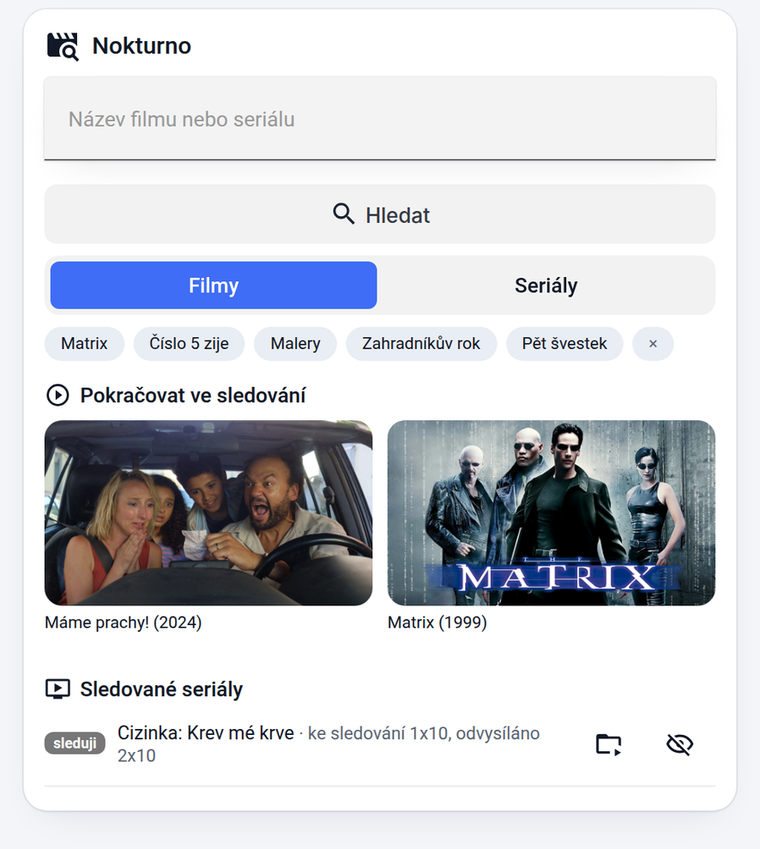
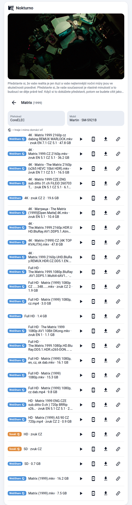
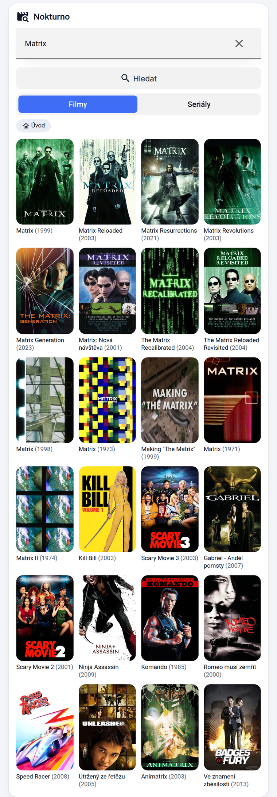
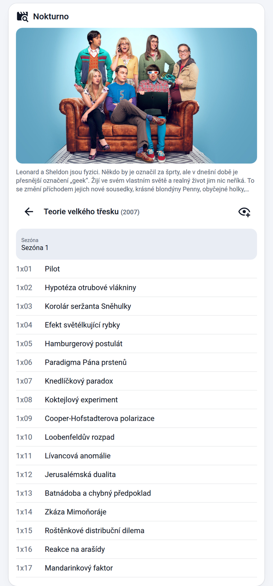

# Nokturno pro Home Assistant

[](https://ko-fi.com/matata86)
[](https://hacs.xyz/)

Hledání filmů a seriálů ve **WebShare**, **Sosáči** a **Luně** přímo z Home Assistantu — s přehráním v Kodi, stažením do HA nebo odesláním odkazu do mobilu.

> **Patří k sobě:** [**plugin.video.nokturno**](https://github.com/matata86/plugin.video.nokturno) je klient pro Kodi, tahle integrace jeho protějšek v Home Assistantu. Sdílejí knihovny zdrojů i účty a přehrávání na TV vede přes doplněk, takže si Kodi drží „Pokračovat ve sledování". Streamovací server Luna jde provozovat jako [addon HA](https://github.com/matata86/ha-addons).

 

## Obsah

- [Co to umí](#co-to-umí)
- [Instalace](#instalace)
- [Nastavení integrace](#nastavení-integrace)
- [Karta na dashboard](#karta-na-dashboard)
- [Ovládací prvky karty](#ovládací-prvky-karty)
- [Entity](#entity)
- [Služby](#služby)
- [Události](#události)
- [Příklady automatizací](#příklady-automatizací)
- [Jak to funguje uvnitř](#jak-to-funguje-uvnitř)
- [Řešení potíží](#řešení-potíží)

## Co to umí

- **Jedno hledání ve všech zdrojích** — stejný titul z Luny i Sosáče se sloučí do jedné položky, streamy se pak nabídnou ze všech zdrojů naráz. U každého streamu je zdroj, kvalita, název souboru, jazyky zvuku i titulků a velikost.
- **Přehrání v Kodi přes doplněk Nokturno**, takže si Kodi vede „Pokračovat ve sledování" a pamatuje si pozici. Ostatní přehrávače (TV, Cast) dostanou přímé URL.
- **Odeslání do mobilu** — notifikace s odkazem, klepnutím se spustí ve VLC (posílá se jako Android intent s typem videa, jinak by telefon soubor jen stáhl).
- **Stahování do `/media/nokturno`** s frontou a průběhem; hotové soubory jsou vidět v kartě, dají se přehrát nebo smazat. Titulky se stáhnou vedle videa.
- **Odkazy použitelné mimo domácí síť** (ikona 🌐) — přímo z CDN WebShare nebo ze Sosáče; ostatní se přepíšou na adresu z Tailscale/VPN, když ji vyplníš a addon Tailscale běží.
- **Pokračovat ve sledování** ze všech Kodi v domácnosti; klepnutí pokračuje na tom, kde jsi to rozkoukal.
- **Sledované seriály** — nový díl se hlásí, až když se dá pustit, ne když ho jen eviduje TMDB.
- **Trakt.tv** — propojení účtu, hlášení přehrávání, zápis do historie a hlídání seznamu „k zhlédnutí": jednou denně se kontroluje, co už má stream, a přijde oznámení.
- **Hlasovka jedním krokem** — službám stačí `query` místo ID.

## Instalace

### HACS (doporučeno)

1. HACS → tři tečky vpravo nahoře → **Vlastní repozitáře**
2. URL `https://github.com/matata86/nokturno-ha`, typ **Integrace**
3. Najdi **Nokturno**, nainstaluj a restartuj Home Assistant
4. **Nastavení → Zařízení a služby → Přidat integraci → Nokturno**

Kartu integrace naservíruje sama a sama si ji zapíše do zdrojů Lovelace (`/nokturno/nokturno-card.js?v=…`) — nic nepřidávej ručně. Pokud jsi ji tam dřív přidal z `/local/…`, ten záznam odeber.

### Ručně

Zkopíruj složku `custom_components/nokturno` do své konfigurace a restartuj HA.

> **Po aktualizaci** mobilní aplikaci úplně zavři a otevři znovu, ať si stáhne novou verzi karty.

## Nastavení integrace

Průvodce má dva kroky. **Účty** — vyplň jen zdroje, které chceš používat:

| Pole | Popis |
|---|---|
| WebShare — e-mail, heslo | fulltextové hledání souborů, přímé odkazy z CDN, titulky. Heslo lze zadat i jako uložený salted hash. |
| Streamuj.tv — uživatel, heslo | streamy Sosáče (české tituly a dabing) |
| Luna — adresa, token | katalogy TMDB, metadata a streamy přes [Lunu](https://github.com/matata86/ha-addons); token lze vložit i jako celou instalační URL |

**Předvolby přehrávání** (jdou kdykoli změnit v *Nastavení → Zařízení a služby → Nokturno → Konfigurovat*):

| Pole | Výchozí | K čemu |
|---|---|---|
| Výchozí přehrávač | — | Kodi, na které se pouští, když se v kartě nevybere jiné |
| Preferovaný jazyk zvuku | CZ | takové streamy jdou v seznamu nahoru |
| Preferovat prostorový zvuk | vypnuto | 5.1 a víc má přednost při shodné kvalitě |
| Skrýt SD streamy | vypnuto | vyhodí kvalitu pod 720p |
| Max. velikost streamu (GB) | 0 | 0 = bez omezení |
| Řazení streamů | quality | `quality`, `size_desc`, `size_asc`, `source` |
| Složka pro stahování | `/media/nokturno` | musí být uvnitř `media_dirs`, ať je vidět v Médiích |
| Adresa mimo domácí síť | — | Tailscale/VPN adresa HA (např. `100.94.191.65`); použije se jen když addon Tailscale běží |
| Oznámení | — | notify služba telefonu (`notify.mobile_app_…`); prázdné = oznámení v HA |
| Trakt.tv — Client ID, Secret | — | z [trakt.tv/oauth/applications](https://trakt.tv/oauth/applications), redirect URI `urn:ietf:wg:oauth:2.0:oob` |

Po vyplnění Traktu spusť službu `nokturno.trakt_auth` — přijde oznámení s kódem, který zadáš na [trakt.tv/activate](https://trakt.tv/activate).

## Karta na dashboard

Přidej kartu **Nokturno** (`custom:nokturno-card`). Má vizuální editor, takže stačí vybrat přehrávače a mobil.

```yaml
type: custom:nokturno-card
title: Nokturno                  # nadpis karty
show_header: true                # false skryje nadpis i ikonu
player: media_player.coreelec    # výchozí přehrávač
players:                         # nabídka v detailu (víc Kodi, TV, Cast…)
  - media_player.coreelec
  - media_player.samsung_tv_q6
phone: notify.mobile_app_muj_telefon   # výchozí mobil pro odeslání odkazu
phones:                          # volitelně ruční seznam; jinak se doplní sám
  - notify.mobile_app_muj_telefon
downloads: sensor.nokturno_stahovani   # senzor s frontou stahování
```

Vše je volitelné: bez `player` se vezme první `media_player`, bez `phone` první telefon s aplikací HA, `downloads` má výchozí hodnotu.

| Pole v editoru | Odpovídá |
|---|---|
| Nadpis karty | `title` |
| Zobrazit nadpis a ikonu | `show_header` |
| Výchozí přehrávač | `player` |
| Přehrávače na výběr | `players` |
| Výchozí mobil | `phone` (nabídka se plní z telefonů, které integrace našla, i se jménem majitele) |
| Senzor stahování | `downloads` |

## Ovládací prvky karty

### Úvodní obrazovka


- **Pole pro hledání** a tlačítko **Hledat**; pod nimi přepínač **Filmy / Seriály**.
- **Štítky** s posledními dotazy — klepnutím se hledání zopakuje, křížek historii smaže.
- **Pokračovat ve sledování** — rozkoukané tituly a další díly ze všech Kodi. U víc zařízení je na dlaždici jméno toho, kde je titul rozkoukaný; klepnutí pokračuje právě tam.
- **Sledované seriály** — zelený štítek „nový díl" znamená, že další epizoda už má stream. Ikony: ✓ odškrtne nový díl, 📂 otevře seriál, 👁 přestane sledovat.
- **K zhlédnutí (Trakt)** — seznam z Traktu; zelené „lze pustit" u titulů, které už mají stream, jinak „zatím ne". Klepnutí otevře streamy.
- Dole **fronta stahování** s procenty a **Stažené** soubory (přehrát / smazat) i s volným místem.

### Výsledky hledání



Mřížka plakátů s názvem a rokem. Titul, který má jen Sosáč, dostane plakát z TMDB. Po klepnutí se přes plakát položí kolečko, dokud se streamy nenačtou. **Úvod** vlevo nahoře se vrátí zpět.

### Seriál a epizody



Nahoře fanart a popis (klepnutím se rozbalí celý), pod ním název s rokem, šipka zpět a **oko** pro sledování nových dílů. Výběr sezóny je pod názvem, epizody se pak vypíšou jako seznam.

### Streamy


Každý řádek: **štítek zdroje** (WebShare modrý, Sosáč oranžový, Luna fialová) s 🌐 u odkazů, které hrají i mimo domácí síť, a popis `kvalita · název souboru · zvuk · titulky · velikost`. Vpravo čtyři akce:

| Ikona | Co udělá |
|---|---|
| ▶ | pustí stream na vybraném přehrávači (Kodi přes doplněk, ostatní přímým odkazem) |
| 📱 | pošle odkaz do vybraného mobilu jako notifikaci; klepnutím se otevře ve VLC |
| ⬇ | stáhne do složky pro stahování (i s titulky) |
| 🔗 | zkopíruje přímý odkaz do schránky |

Nad seznamem jsou výběry **Přehrávač** a **Mobil** — platí pro všechny akce v seznamu.

## Entity

| Entita | Stav | Atributy |
|---|---|---|
| `sensor.nokturno_stahovani` | počet běžících stahování | `downloads` (fronta), `files` (hotové soubory), `free_gb`, `directory`, `search_history`, `notify_targets` |
| `sensor.nokturno_nove_dily` | kolik sledovaných seriálů má nový díl | `series` — u každého `latest` (odvysíláno), `available` (nejnovější se streamem), `new`, `checked` |
| `sensor.nokturno_k_zhlednuti` | kolik titulů z Traktu už má stream | `total`, `items` (id, název, rok, počet streamů, nejlepší stream) |

## Služby

Služby označené **↩** vracejí data — volej je s `response_variable`.

### `nokturno.search` ↩
Hledání ve zdrojích. `query` (povinné), `type` = `movie` (výchozí) / `series` / `webshare`, `limit` (1–60, výchozí 20).
Vrací `results`: `id`, `type`, `title`, `year`, `poster`, `background`, `description`, `alt` (id téhož titulu v druhém zdroji), `source`.

### `nokturno.streams` ↩
Streamy titulu. `id` nebo `query`, `type`, volitelně `alt`, `series`, `season`, `episode`.
Vrací `streams`: `index`, `label`, `source`, `quality`, `size_gb`, `bitrate`, `langs`, `channels`, `subs`, `direct` (hraje i mimo síť), `url`, `ws_url`, `subtitles`.

### `nokturno.episodes` ↩
Sezóny a epizody seriálu. `id` (povinné), volitelně `season`.

### `nokturno.resolve` ↩
Přímé HTTP URL streamu pro cizí přehrávač. Stejné parametry jako `streams` + `stream` (index) nebo `url`.

### `nokturno.play`
Přehraje. `id` nebo `query`, volitelně `entity_id` (přehrávač), `stream` (index; bez něj nejlepší podle předvoleb), `season`, `episode`, `alt`, `direct: true` (i pro Kodi přímé URL místo doplňku).

### `nokturno.download`
Stáhne do složky pro stahování. Parametry jako `resolve` + `name`. Odmítne soubor, který by se nevešel.

### `nokturno.send_link`
Pošle odkaz do mobilu. `notify_service` (povinné, `notify.mobile_app_…`), dál jako `resolve` + `name`, `title`.

### `nokturno.cancel_download` / `nokturno.delete_file`
Zruší stahování (`download_id`) / smaže stažený soubor (`path`, musí být ve složce pro stahování).

### `nokturno.continue_watching` ↩
Rozkoukané tituly ze všech Kodi (nebo z jednoho přes `entity_id`). U každé položky `entity_id` zdrojového Kodi a `file` (plugin odkaz, který pokračuje od uložené pozice).

### `nokturno.watch_series` ↩ / `nokturno.check_series` ↩ / `nokturno.mark_seen` ↩
Sledování seriálů: přidat (`id`, `title`, `alt`, `poster`) nebo odebrat (`remove: true`); ruční kontrola nových dílů; zhasnutí označení nového dílu (bez `id` u všech).

### `nokturno.trakt_auth` ↩ / `nokturno.trakt_watched` ↩ / `nokturno.trakt_watchlist` ↩
Propojení účtu kódem, zápis filmu nebo epizody do historie (`id`, `season`, `episode`, `remove`), načtení seznamu „k zhlédnutí" s kontrolou dostupnosti.

### `nokturno.clear_history`
Smaže historii hledání zobrazenou v kartě.

## Události

| Událost | Kdy | Data |
|---|---|---|
| `nokturno_download_done` | po dostažení | `name`, `path`, `size` |
| `nokturno_new_episode` | nový díl sledovaného seriálu má stream | `id`, `title`, `season`, `episode`, `released` |
| `nokturno_trakt_available` | titul z Traktu nově má stream | `id`, `title`, `type`, `streams` |

## Příklady automatizací

Hlasovka „pusť Matrix na televizi":

```yaml
sequence:
  - action: nokturno.play
    data:
      query: "{{ nazev }}"
      type: movie
      entity_id: media_player.coreelec
```

Jemnější řízení s výběrem streamu:

```yaml
sequence:
  - action: nokturno.streams
    data:
      query: "{{ nazev }}"
      type: movie
    response_variable: nalezeno
  - action: nokturno.play
    data:
      id: "{{ nalezeno.streams[0].index is defined and nazev }}"
      query: "{{ nazev }}"
      stream: >-
        {{ (nalezeno.streams | selectattr('direct') | list | first).index }}
      entity_id: media_player.coreelec
```

Když se objeví film ze seznamu Traktu, stáhni ho:

```yaml
triggers:
  - trigger: event
    event_type: nokturno_trakt_available
actions:
  - action: nokturno.download
    data:
      id: "{{ trigger.event.data.id }}"
      type: "{{ trigger.event.data.type }}"
```

## Jak to funguje uvnitř

- **Zdroje jsou rovnocenné** a žádný není povinný. Luna přidává katalogy a metadata, Sosáč české tituly, WebShare fulltext a přímé odkazy.
- **Slučování titulů**: shoda názvu (i originálu) a roku ±1; id protějšku putuje dál jako `alt`, takže se u titulu nabídnou streamy z obou zdrojů.
- **Odkazy mimo síť**: streamy z Luny míří na její adresu v LAN, proto se páruje s fulltextem WebShare podle velikosti (±0,25 GB) a kvality a k položce se přibalí přímý odkaz z CDN. Hledá se pod českým i originálním názvem (z Sosáče nebo z Cinemety). Zbytek se přepíše na `external_host`, pokud addon Tailscale běží.
- **Náhledy Sosáče** jsou od září 2026 mrtvé (404), plakáty se dotahují z TMDB — podle IMDb id, a když chybí, podle názvu a roku.
- **Nový díl seriálu** se hlásí až podle dostupnosti streamu; při zařazení se najde nejnovější sezóna se streamy, dál se sleduje jen posun dopředu.
- Knihovny v `custom_components/nokturno/lib/` jsou kopie z Kodi doplňku, aby se obě aplikace chovaly stejně.

## Řešení potíží

| Problém | Co s tím |
|---|---|
| Karta hlásí chybu nastavení, na desktopu je v pořádku | mobilní aplikaci úplně zavři a otevři znovu (drží si stránku v cache) |
| Karta se načte dvakrát / „already used" | odeber ruční záznam `/local/nokturno/…` ze zdrojů Lovelace |
| Změny v integraci se neprojeví | po zásahu do Pythonu je nutný restart HA Core, reload integrace nestačí |
| U titulu chybí plakát | Sosáč obrázky nemá; pokud nejde dohledat ani přes TMDB, zůstane podklad s ikonou |
| Stream nejde pustit venku | vyber řádek s 🌐, nebo vyplň adresu Tailscale a zkontroluj, že addon běží |
| Trakt hlásí „nepřihlášeno" | spusť `nokturno.trakt_auth` a zadej kód na trakt.tv/activate |

## Související projekty

| Projekt | K čemu |
|---|---|
| [plugin.video.nokturno](https://github.com/matata86/plugin.video.nokturno) | klient pro Kodi — stejné zdroje, přes něj se pouští na TV |
| [ha-addons](https://github.com/matata86/ha-addons) | addony pro HA: server Luna a proxy Sosáče pro Nuvio |
| [fns-ha-tweaks](https://github.com/matata86/fns-ha-tweaks) | sdílený vzhled a karty pro Home Assistant |

## Licence

MIT

---

Líbí se ti to? ☕ [Podpoř autora na Ko-fi](https://ko-fi.com/matata86)
